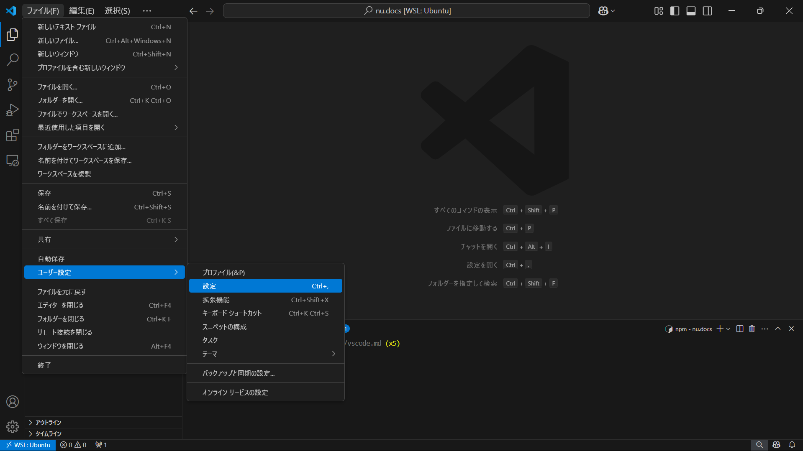

# Visual Studio Code（VSCode）導入・使い方＋α


##  VSCodeとは？
- Microsoftが開発した無料のコードエディタ
- 軽量かつ高機能（拡張機能・デバッグ・Git統合など）
- Web開発、Python、C++ など様々な言語に対応


##  インストール手順

1. 公式サイト（https://code.visualstudio.com/）からダウンロード
2. インストーラを実行してインストール
3. 起動後、左の「拡張機能」アイコン（四角が4つ）でプラグインを追加可能

##  基本的な使い方

###  プロジェクトを開く
- editorでVScodeを選択
- code .と打つとターミナルからVScodeを起動可能

```bash
code .

```

###  ファイルの作成・編集
- 右側のエクスプローラーで新しいファイルやフォルダー作成。
- 保存は `Ctrl + S`（macは `Cmd + S`）

###  ターミナルの使用
- 上側のパネルの切り替えを押す(いちいちターミナル画面に切り替える手間がなくなる!!)
- `bash`, `zsh`, `PowerShell`, `cmd` などが利用可能

###  Git操作
- 左のソース管理からコミットやプッシュが可能(guiなのでコマンドでうつよりやりやすい)


## 自動保存(任意)
- VScodeを開いてファイル→ユーザー設定→設定を開く。
- 設定画面が表示されたら検索ボックスに「Auto　Save」と入力し、Files:Auto Saveをoffからdelayに。



##  おすすめ拡張機能

| 拡張機能名 | 説明 |
|------------|------|
| **Japanese Language Pack for VS Code** | VSCodeを日本語化 |
| **Prettier - Code formatter** | 自動コード整形 |
| **ESLint** | JavaScriptの文法チェック |
| **Python** | VScode上でボタンを押しただけでパイソンを実行 |
